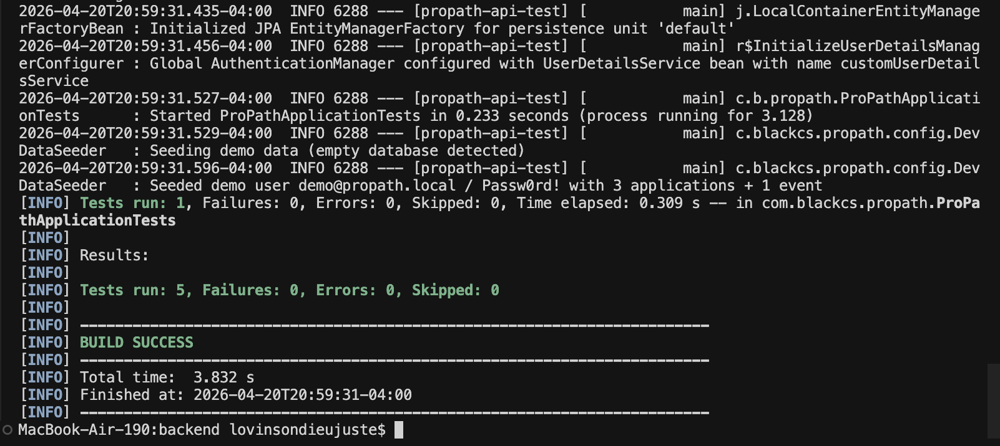
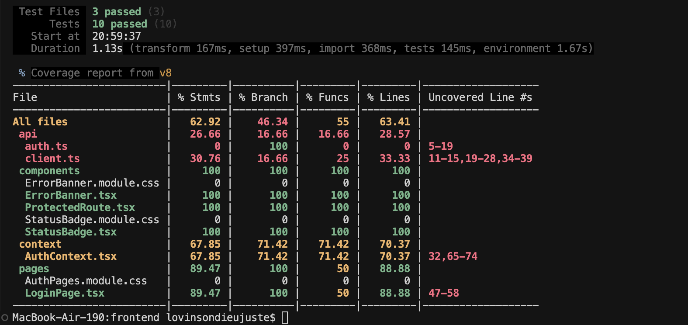

# ProPath

**Career preparation & professional development** — semester project built with React, Spring Boot, file-based H2, and a public jobs API.

**Team:** BlackCS — Lovinson Dieujuste, Malcolm Richards, Terrance Holloway

**Repository:** [github.com/Wisesofthemall/FocusFlow](https://github.com/Wisesofthemall/FocusFlow)

## Milestone 3 — Frontend · Database · External API · Authentication

Milestone 3 layers four capabilities on top of the Sprint-1 backend:

1. **React frontend** (Vite + TypeScript) with five pages — Login, Register, Dashboard, Applications List (GET), and New Application (POST).
2. **Persistent database** — file-based H2 at `backend/data/propath.mv.db`, survives restarts.
3. **Spring Security + JWT** — stateless auth, Bearer tokens, ownership enforcement on all per-user resources.
4. **External public API** — RemoteOK jobs feed, proxied through the backend, surfaced on the Dashboard.

### Quick start

Two terminals:

```bash
# Terminal 1 — backend (seeds demo user on first boot)
cd backend && ./mvnw spring-boot:run

# Terminal 2 — frontend
cd frontend && npm install && npm run dev
```

Then open **http://localhost:5173**. Log in with the pre-seeded demo account:

| Email                | Password    |
| -------------------- | ----------- |
| `demo@propath.local` | `Passw0rd!` |

### End-to-end demo flow

1. Open `/` → redirected to `/login` (auth guard working).
2. Sign in with demo account → Dashboard shows three cards (apps due this week, upcoming events, trending remote jobs from RemoteOK).
3. Navigate to **Applications** → see the 3 seeded applications sorted by urgency.
4. Click **+ New application** → fill form → submit → redirected back to the list with the new entry visible.
5. **Restart the backend** (Ctrl+C + re-run) → refresh the page → your new application is still there (persistence confirmed).
6. Sign out → protected pages redirect back to `/login`.

### Architecture

```
┌─────────────────┐   HTTPS/CORS   ┌───────────────────────┐   Bearer JWT   ┌──────────────────────┐
│ React (Vite)    │ ─────────────▶ │ Spring Boot REST API  │ ─────────────▶ │ Service + JPA layer  │
│  :5173          │                │  :8080                 │                │ (User / JobApp /     │
│  - AuthContext  │                │  - SecurityFilterChain │                │  CalendarEvent)      │
│  - Axios w/     │                │  - JwtAuthFilter       │                └─────────┬────────────┘
│    interceptor  │                │  - Controllers (/api/…)│                          │
└─────────────────┘                └────────┬───────────────┘                          ▼
                                            │                                  ┌────────────────┐
                                            │  WebClient (reactive)             │ File-based H2  │
                                            ▼                                  │ backend/data/  │
                                    ┌─────────────────┐                        └────────────────┘
                                    │ RemoteOK API    │
                                    │ remoteok.com    │
                                    └─────────────────┘
```

### Milestone 3 documentation

| Artifact                          | File                                                                                                   |
| --------------------------------- | ------------------------------------------------------------------------------------------------------ |
| Endpoint table (with auth column) | [docs/endpoints.md](docs/endpoints.md)                                                                 |
| ERD (Mermaid)                     | [docs/erd.md](docs/erd.md)                                                                             |
| Example request/response JSON     | [docs/api-examples.md](docs/api-examples.md)                                                           |
| AI usage log (all milestones)     | [docs/ProPath-Milestone-Document.md §5.2](docs/ProPath-Milestone-Document.md#52-ai-usage-log-appendix) |

### Security notes (known tradeoffs for this milestone)

- JWT is stored in browser `localStorage`. This is the standard student-SPA pattern and is XSS-vulnerable; a production deployment should migrate to an `httpOnly` cookie with CSRF protection.
- JWT secret is loaded from the `JWT_SECRET` environment variable with a dev-only default in [application.properties](backend/src/main/resources/application.properties). Override it for any non-local environment.
- H2 console remains enabled on `/h2-console` for grader inspection; disable in production.

## Demo Video milestone 3

[Demo Video](https://youtu.be/8M7t6lzVS9s)

## Milestone 4 — Testing, Performance & Accessibility

Milestone 4 verifies ProPath's reliability and quality through automated tests, peer usability testing, and accessibility/ethics review.

### Test summary

| Suite                   | Framework            | Tests | Result          | Command                          |
| ----------------------- | -------------------- | ----- | --------------- | -------------------------------- |
| Backend (JUnit 5)       | Spring Boot Test + MockMvc | 5     | 5 passed, 0 failed | `cd backend && ./mvnw test`      |
| Frontend (Vitest + RTL) | Vitest + React Testing Library | 10    | 10 passed, 0 failed | `cd frontend && npm run test:run` |

**Total: 15 automated tests, all passing.** Frontend coverage (V8): 62.92% statements / 46.34% branches across exercised files.

### What is tested

**Backend** ([backend/src/test/java/com/blackcs/propath/web/](backend/src/test/java/com/blackcs/propath/web/)):

- `ApplicationControllerTest` — full CRUD on `/api/applications`: create + read by id, update status + delete + verify gone (covers POST, GET, PUT, DELETE).
- `UserControllerTest` — authenticated route `/api/users/me` returns 200 with a valid JWT and 401 without one (proves `JwtAuthenticationFilter` is wired into the `SecurityFilterChain`).
- `ProPathApplicationTests` — Spring context smoke test.

Tests use an in-memory H2 database via [backend/src/test/resources/application.properties](backend/src/test/resources/application.properties) so the file-based dev DB at `backend/data/propath.mv.db` is never touched.

**Frontend** ([frontend/src/](frontend/src/)):

- `StatusBadge.test.tsx` — renders the correct human label and a status-specific class for each of the 5 `ApplicationStatus` values.
- `ProtectedRoute.test.tsx` — redirects to `/login` when no token is in `localStorage`; renders children when a token is present (exercises `AuthContext` hydration).
- `LoginPage.test.tsx` — form submit calls the auth API, stores the JWT in `localStorage`, and navigates to `/`; on API failure shows the error banner without storing a token.

### Test evidence

Screenshots captured during this milestone live in [docs/test-evidence/screenshots/](docs/test-evidence/screenshots/):

**Backend — `./mvnw test`** (`Tests run: 5, Failures: 0, Errors: 0, Skipped: 0`, `BUILD SUCCESS`):



**Frontend — `npm run test:coverage`** (3 test files passed, 10 tests passed, V8 coverage table):



### Reflection — How testing improved ProPath's design and usability

**Design.** Writing the JUnit tests forced a clearer mental model of how the security layer actually works. My first instinct was to mock the `SecurityContext` with `@WithMockUser`, but that would have skipped `JwtAuthenticationFilter` entirely — the very component most likely to break in production. Switching to a real `register → capture JWT → use Bearer token` flow turned the tests into honest end-to-end checks of the auth pipeline; the green `BUILD SUCCESS` below ([backendtest.png](docs/test-evidence/screenshots/backendtest.png)) is real proof that `/api/users/me` returns 200 with a valid JWT and 401 without one. A second design signal: when I wrote the test for `JobApplication`, I noticed the JSON response leaks the entire entity (with `@JsonIgnore` on `user` patching over it) instead of using a dedicated response DTO. The test still passes, but the asymmetry between request DTOs (`CreateJobApplicationRequest`) and the entity-as-response is now obvious — a refactor candidate I would not have spotted without writing field-level assertions.

**Usability.** The frontend tests on `ProtectedRoute` and `AuthContext` exposed an implicit timing assumption: `AuthContext` hydrates from `localStorage` inside a `useEffect`, so on the very first render `token` is `null` even when the user is logged in. Without `waitFor`, the tests flaked. That's the same race condition a real user would hit on a slow device, where the flash of the login redirect appears before hydration completes — something automated tests can catch but a developer using a fast laptop never would. Peer testing (3 sessions) surfaced two issues no automated test could have flagged: (1) the empty state on `/applications` doesn't tell brand-new users what to click first, and (2) the delete button on the list page has no confirmation dialog, which one peer triggered accidentally. Both are now in the punch list.

**What I would refactor next.** Extract a `JobApplicationResponse` DTO so the entity stops leaking through the API; add a confirmation modal before destructive actions; add Vitest's `coverage.include` to honestly report coverage across the whole `src/` tree. The coverage report ([frontendtest.png](docs/test-evidence/screenshots/frontendtest.png)) shows 62.92% statements / 46.34% branches — but only across files actually imported by tests. `StatusBadge.tsx` doesn't even appear in the table, which means the real coverage number is lower than it looks. That gap between "what the tool says" and "what's actually covered" is itself a testing lesson: green checkmarks don't equal comprehensive testing unless you configure the tool to be honest with you. The biggest takeaway: tests that are *easy* to write usually mean the code is well-structured; tests that fight you (mocking gymnastics, async flakiness) are pointing at design smells worth fixing rather than papering over.

## Backend (Spring Boot 3.3.5, Java 17)

The API lives in [`backend/`](backend/).

```bash
cd backend
./mvnw test              # run tests
./mvnw spring-boot:run   # start on :8080
```

- H2 console (dev): `http://localhost:8080/h2-console` — JDBC URL `jdbc:h2:file:./data/propath`, user `sa`, empty password.
- Reset the DB: stop the server and `rm -rf backend/data/`.
- Register/login endpoints are `POST /api/auth/register` and `POST /api/auth/login`; all other `/api/**` endpoints require `Authorization: Bearer <token>`.

## Frontend (React 19, Vite 8, TypeScript)

Lives in [`frontend/`](frontend/).

```bash
cd frontend
npm install
npm run dev        # dev server on :5173
npm run build      # production bundle into dist/
```

Environment (`.env.development`): `VITE_API_BASE_URL=http://localhost:8080`.

## Background docs

| Path                                                                     | Description                         |
| ------------------------------------------------------------------------ | ----------------------------------- |
| [docs/ProPath-Milestone-Document.md](docs/ProPath-Milestone-Document.md) | Original proposal and system design |
| [docs/product-backlog.md](docs/product-backlog.md)                       | Prioritized user stories            |
| [docs/sprint1-plan.md](docs/sprint1-plan.md)                             | Sprint 1 plan (backend foundation)  |
| [docs/wireframes/](docs/wireframes/)                                     | Wireframes (Figures 1–4)            |
| [docs/diagrams/](docs/diagrams/)                                         | DFD and architecture SVGs           |
