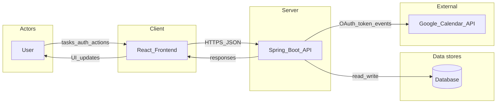
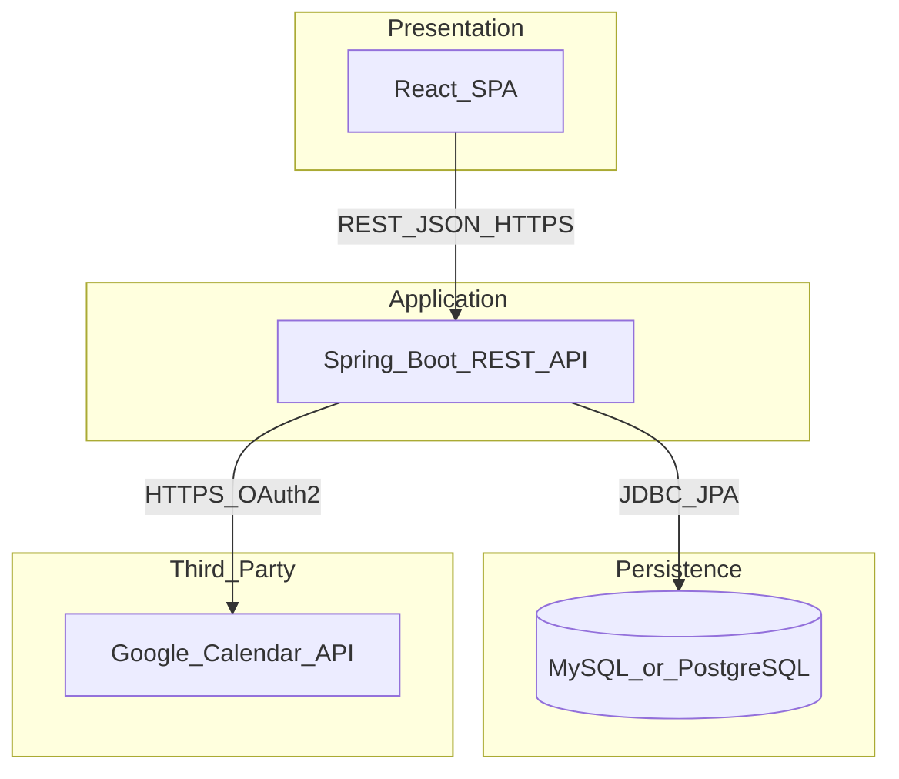

# FocusFlow — Project Proposal & System Design (Milestone Document)

**Course milestone — combined team document**
**Team name:** BlackCS
**Document version:** 1.2 · **Date:** March 24, 2026
**GitHub repository:** [https://github.com/Wisesofthemall/FocusFlow](https://github.com/Wisesofthemall/FocusFlow)

_BlackCS: add each teammate’s **full name** in the Section 7 roles table before final submission (course rubric: team collaboration)._

---

## 1. Project Overview

### 1.1 Problem statement

Students and others juggling coursework or personal deadlines often lose track of what is due when. Tasks spread across syllabi, LMS tools, chat, and paper notes create **fragmentation**, which leads to **missed deadlines**, **last-minute cramming**, and **poor time allocation**. The problem is worth solving because small improvements in visibility and prioritization reduce stress and improve academic outcomes without requiring users to adopt complex project-management tools.

### 1.2 Target users

- **Primary:** Students (high school and college) managing assignments, exams, and study blocks.
- **Secondary:** Anyone balancing school-like workloads or personal learning goals (e.g., certification prep, part-time learners).

### 1.3 Value proposition

FocusFlow gives users **one simple dashboard** where tasks are **organized**, **editable**, and **automatically ordered by urgency** so “what matters today” is obvious. Connecting a calendar surfaces **real schedule context** (classes, meetings, synced events) so users can **plan tasks around fixed commitments** instead of guessing.

### 1.4 Minimum viable product (MVP)

| Area                     | MVP capability                                                                                                                               |
| ------------------------ | -------------------------------------------------------------------------------------------------------------------------------------------- |
| **Auth**                 | User signup and login (secure sessions; password or OAuth per course policy).                                                                |
| **Tasks**                | Create, edit, delete tasks; set **due date** and **status** (e.g., todo / in progress / done).                                               |
| **Priority / sorting**   | **Auto-sort** by urgency (e.g., due date ascending, with optional priority field or overdue boost).                                          |
| **Dashboard**            | **Today’s tasks** view: tasks due today (and optionally overdue), sorted.                                                                    |
| **Calendar integration** | User **connects** Google Calendar (OAuth); app **fetches upcoming events** and shows them alongside tasks (read-only for MVP is acceptable). |

This MVP is the **smallest** version that still solves the core problem: clarity + today-focused execution + schedule awareness.

---

## 2. External API integration (required)

### 2.1 Planned API: Google Calendar API

- **Data provided:** Calendar **events** (title, start/end times, optional location/description), for the user’s selected calendar(s).
- **How FocusFlow uses it (meaningful to the product):**
  - After the user authorizes access, the backend retrieves **upcoming events** for a configurable window (e.g., next 7–14 days).
  - The **dashboard** displays **events near “today”** next to **today’s tasks**, so users see **fixed commitments** when deciding what to study or finish first.
  - Tasks remain the source of truth for assignments; events provide **context** (not unrelated decoration).

### 2.2 Fallback option

If OAuth scope or timeline is too heavy for the semester, the team may use a **public holidays API** (country/region) to flag days that disrupt routines. That remains schedule-relevant but is weaker than per-user calendar; the proposal would be updated to state this choice explicitly.

---

## 3. System design

### 3.1 System modules (major components)

1. **Authentication module** — Registration, login, session/JWT issuance, optional OAuth for Google.
2. **Task manager module** — CRUD for tasks; validation; maps to persistence layer.
3. **Calendar integration module** — OAuth token storage (secure), sync job or on-demand fetch from Google Calendar API, normalization to internal “event” representation.
4. **Dashboard module (API + UI)** — Aggregates **today’s tasks** (and optional “this week”) plus **near-term calendar events** for the logged-in user.
5. **Sorting / priority service** — Central rules for urgency (due date, overdue, optional explicit priority) so list and dashboard stay consistent.

### 3.2 Level-0 data flow diagram (DFD)

The diagram below shows **user**, **React frontend**, **Spring Boot API**, **database**, and **external API**.

**Narration:** The user interacts with the React app. The frontend sends authenticated requests to the Spring Boot API for tasks and dashboard data. The API persists users and tasks in the database and, when authorized, calls the Google Calendar API to retrieve events, merges that data for the dashboard, and returns JSON to the client.

**Mermaid source (optional, for tools that render Mermaid):**

### 3.3 Entities / data objects and relationships

**User**

| Attribute            | Description                                                     |
| -------------------- | --------------------------------------------------------------- |
| `id`                 | Primary key (UUID or long).                                     |
| `name`               | Display name.                                                   |
| `email`              | Unique login identifier.                                        |
| `passwordHash`       | If using password auth (never store plain text).                |
| `googleRefreshToken` | Encrypted/stored only if using Calendar OAuth (optional field). |

**Task**

| Attribute                 | Description                                   |
| ------------------------- | --------------------------------------------- |
| `id`                      | Primary key.                                  |
| `userId`                  | Foreign key → User.                           |
| `title`                   | Short description.                            |
| `dueDate`                 | Date/time for sorting and “today” filter.     |
| `priority`                | e.g., LOW / MEDIUM / HIGH (optional for MVP). |
| `status`                  | e.g., TODO / IN_PROGRESS / DONE.              |
| `createdAt` / `updatedAt` | Audit fields.                                 |

**CalendarEvent** (DTO or cached entity; full table optional in MVP)

| Attribute       | Description                               |
| --------------- | ----------------------------------------- |
| `id`            | External id from Google or composite key. |
| `userId`        | Owner.                                    |
| `title`         | Event summary.                            |
| `start` / `end` | Instant or datetime.                      |
| `source`        | e.g., `GOOGLE`                            |

**Relationships**

- **User 1 — N Task:** Each task belongs to one user.
- **User 1 — N CalendarEvent (logical):** Events belong to the user; MVP may fetch live from Google and map to DTOs without persisting, or cache rows for performance—the team will document the chosen approach in the implementation milestone.

### 3.4 Architecture diagram

**Caption:** Single-page React client communicates only with the Spring Boot API; the API owns database access and external calendar calls.

**Mermaid source (optional):**

---

## 4. Demo-centric planning

**Demo storyboard (aligns with rubric)**

1. **Introduce the problem** — Fragmented deadlines and weak “what’s due today” visibility.
2. **Show the solution** — FocusFlow dashboard combining tasks and calendar context.
3. **Live flow**
   - Log in (or sign up, then log in).
   - Add two or three tasks with different due dates (one due today, one tomorrow, one next week).
   - Show **auto-sort** (list or dashboard reordering by urgency).
   - **Connect Google Calendar** (or use a pre-connected demo account); **upcoming events** appear.
   - Return to the dashboard: **Today’s tasks** plus **today’s / near-term events** are visible together.
   - Mark a task complete; show **UI refresh** and **persisted** state after reload or re-fetch.

The MVP supports **user → creates record → system updates DB → UI shows sorted/dashboard view** for evaluators.

---

## 5. Responsible AI usage

### 5.1 Integrity statement

**BlackCS** used **ChatGPT** to brainstorm **app ideas** that could satisfy the course milestone requirements. The team **evaluated** suggestions, chose **FocusFlow**, and **wrote and reviewed** the final proposal, diagrams, and wireframes. API choice, entities, and architecture are **BlackCS decisions** after critical review of AI output.

### 5.2 AI usage log (appendix)

_Current log for this milestone; add rows below if the team uses additional AI tools in later work._

| Date           | Tool    | Prompt summary (paraphrased)                                                                                                                                  | Purpose                                                | How results influenced BlackCS design                                                                                                                                   |
| -------------- | ------- | ------------------------------------------------------------------------------------------------------------------------------------------------------------- | ------------------------------------------------------ | ----------------------------------------------------------------------------------------------------------------------------------------------------------------------- |
| March 24, 2026 | ChatGPT | Asked for app ideas that would satisfy the full-stack milestone (real problem, MVP, external API, system design, demo-friendly flow, feasible for a semester) | Ideation and early scoping before locking the proposal | Surfaced **FocusFlow** (smart study planner): tasks with due dates, “today” dashboard, **Google Calendar** for schedule context, **React + Spring Boot + DB** direction |

---

## 6. Design artifacts (wireframes)

Low-fidelity wireframes for core screens. Reference as **Figure 1–4** in presentations or written reports.

| Figure | File                                                                                   | Description                               |
| ------ | -------------------------------------------------------------------------------------- | ----------------------------------------- |
| 1      | [wireframes/01-login.svg](wireframes/01-login.svg)                                     | Login                                     |
| 2      | [wireframes/02-tasks.svg](wireframes/02-tasks.svg)                                     | Task list with add/edit/delete            |
| 3      | [wireframes/03-dashboard-today.svg](wireframes/03-dashboard-today.svg)                 | Dashboard — Today                         |
| 4      | [wireframes/04-calendar-connect-events.svg](wireframes/04-calendar-connect-events.svg) | Connect Google Calendar + upcoming events |

---

## 7. Project planning

**Team:** BlackCS

### 7.1 Team member roles

| Member name (BlackCS)  | Responsibility                                         |
| ---------------------- | ------------------------------------------------------ |
| _[Lovinson Dieujuste]_ | Frontend (React), UI states, API client                |
| _[Lovinson Dieujuste]_ | Backend (Spring Boot), authentication, task REST APIs  |
| _[Lovinson Dieujuste]_ | Database schema, migrations, JPA entities              |
| _[Lovinson Dieujuste]_ | Google Calendar OAuth and integration, security review |
| _[Lovinson Dieujuste]_ | Documentation, demo script, diagrams and wireframes    |

### 7.2 Collaboration & repository

- **Team:** BlackCS
- **GitHub:** [https://github.com/Wisesofthemall/FocusFlow](https://github.com/Wisesofthemall/FocusFlow)
- **Practices:** feature branches, pull requests, README updates per milestone, shared doc review before due dates.

---

## 8. Success criteria checklist (self-review)

- [ ] Problem statement explains real pain and why it matters
- [ ] Full-stack design is feasible: **React + Spring Boot + MySQL/PostgreSQL + Google Calendar API**
- [ ] System modules, **Level-0 DFD**, **entities** with **relationships**, **architecture** diagram included
- [ ] External API **meaningfully** supports planning around the user’s schedule
- [ ] Demo path is clear from MVP features
- [ ] **AI usage log** completed accurately
- [ ] **Team name (BlackCS)** and **individual names** in Section 7, **repo link** correct, **wireframes** attached or embedded

---

## 9. Repository artifacts (this project)

| Artifact           | Path                                                                 |
| ------------------ | -------------------------------------------------------------------- |
| Milestone (source) | [FocusFlow-Milestone-Document.md](./FocusFlow-Milestone-Document.md) |
| Wireframes (SVG)   | [wireframes/](wireframes/)                                           |
| Diagrams (SVG)     | [diagrams/](diagrams/)                                               |
