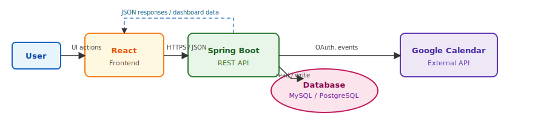
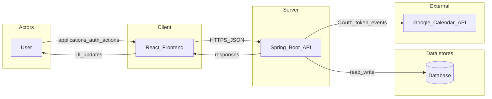
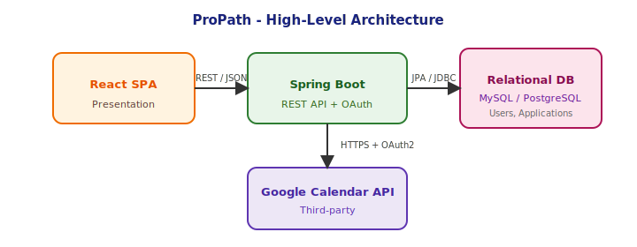
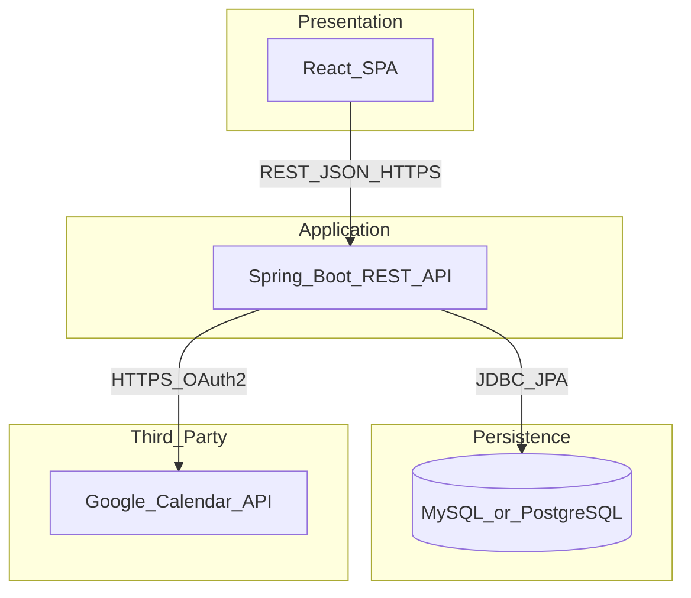
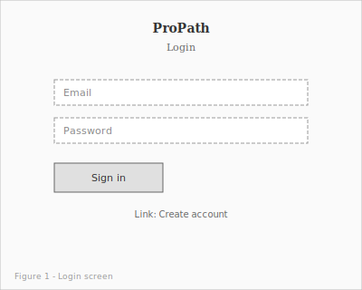
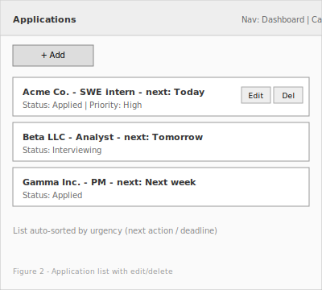
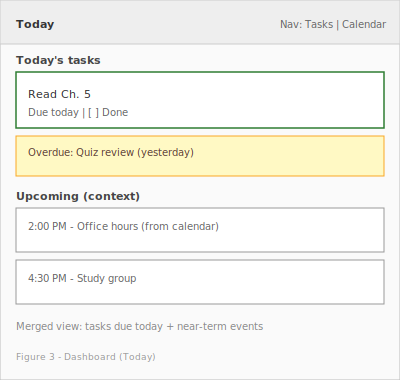
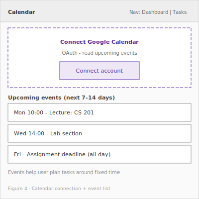

# ProPath — Project Proposal & System Design (Milestone Document)

**Career preparation & professional development**

**Course milestone — combined team document**  
**Team name:** BlackCS  
**Document version:** 2.0 · **Date:** March 25, 2026  
**GitHub repository:** [https://github.com/Wisesofthemall/FocusFlow](https://github.com/Wisesofthemall/FocusFlow)

---

## 1. Project Overview

### 1.1 Problem statement

Job seekers and professionals building their careers often juggle **applications, interviews, follow-ups, and skill goals** across spreadsheets, email, bookmarks, and memory. That **fragmentation** leads to **missed deadlines**, **dropped opportunities**, and **stress**. The problem is worth solving because clearer visibility and prioritization improve outcomes without forcing users onto heavyweight enterprise tools.

### 1.2 Target users

- **Primary:** Students and early-career professionals preparing to enter or change fields.
- **Secondary:** Anyone organizing job applications, networking, and professional growth alongside other commitments.

### 1.3 Value proposition

**ProPath** gives users **one dashboard** where **job applications** are **organized**, **editable**, and **automatically ordered by urgency** so “what needs attention today” is obvious. Connecting **Google Calendar** surfaces **real schedule context** (interviews, career fairs, reminders, synced events) so users can **plan next actions around fixed commitments** instead of guessing.

### 1.4 Minimum viable product (MVP)

| Area                     | MVP capability                                                                                                                                 |
| ------------------------ | ---------------------------------------------------------------------------------------------------------------------------------------------- |
| **Auth**                 | User signup and login (secure sessions; password or OAuth per course policy).                                                                  |
| **Applications**         | Create, edit, delete **job applications**; fields include **company**, **role/title**, **status** (e.g. applied / interviewing / offer / rejected), **next action or deadline** for sorting and reminders. |
| **Priority / sorting**   | **Auto-sort** by urgency (e.g. next action or deadline ascending, with optional priority field or overdue boost).                               |
| **Dashboard**            | **Today / this week** view: applications needing attention soon (and optionally overdue follow-ups), sorted.                                  |
| **Calendar integration** | User **connects** Google Calendar (OAuth); app **fetches upcoming events** and shows them alongside applications (read-only for MVP is acceptable). |

This MVP is the **smallest** version that still solves the core problem: clarity + today-focused execution + schedule awareness for career preparation.

---

## 2. External API integration (required)

### 2.1 Planned API: Google Calendar API

- **Data provided:** Calendar **events** (title, start/end times, optional location/description), for the user’s selected calendar(s).
- **How ProPath uses it (meaningful to the product):**
  - After the user authorizes access, the backend retrieves **upcoming events** for a configurable window (e.g. next 7–14 days).
  - The **dashboard** displays **events near “today”** next to **upcoming application actions**, so users see **interviews, networking blocks, and fixed commitments** when deciding what to do first.
  - **Applications** remain the source of truth for the job search; events provide **schedule context** (not unrelated decoration).

### 2.2 Fallback option

If OAuth scope or timeline is too heavy for the semester, the team may use a **public holidays API** (country/region) to flag days that disrupt routines. That remains schedule-relevant but is weaker than per-user calendar; the proposal would be updated to state this choice explicitly.

---

## 3. System design

### 3.1 System modules (major components)

1. **Authentication module** — Registration, login, session/JWT issuance, optional OAuth for Google.
2. **Application tracker module** — CRUD for job applications; validation; maps to persistence layer.
3. **Calendar integration module** — OAuth token storage (secure), sync job or on-demand fetch from Google Calendar API, normalization to internal “event” representation.
4. **Dashboard module (API + UI)** — Aggregates **applications due soon** (and optional “this week”) plus **near-term calendar events** for the logged-in user.
5. **Sorting / priority service** — Central rules for urgency (next action or deadline, overdue, optional explicit priority) so list and dashboard stay consistent.

### 3.2 Level-0 data flow diagram (DFD)

The diagram below shows **user**, **React frontend**, **Spring Boot API**, **database**, and **external API**.

**Narration:** The user interacts with the React app. The frontend sends authenticated requests to the Spring Boot API for applications and dashboard data. The API persists users and applications in the database and, when authorized, calls the Google Calendar API to retrieve events, merges that data for the dashboard, and returns JSON to the client.

**Mermaid source (optional, for tools that render Mermaid):**

### 3.3 Entities / data objects and relationships

**User**

| Attribute            | Description                                                     |
| -------------------- | --------------------------------------------------------------- |
| `id`                 | Primary key (UUID or long).                                     |
| `name`               | Display name.                                                   |
| `email`              | Unique login identifier.                                        |
| `passwordHash`       | If using password auth (never store plain text).                |
| `googleRefreshToken` | Encrypted/stored only if using Calendar OAuth (optional field). |

**Application** (job application / opportunity)

| Attribute                 | Description                                                                 |
| ------------------------- | --------------------------------------------------------------------------- |
| `id`                      | Primary key.                                                                |
| `userId`                  | Foreign key → User.                                                         |
| `company`                 | Employer or organization name.                                              |
| `roleTitle`               | Job title or role applied for.                                              |
| `status`                  | e.g. APPLIED / INTERVIEWING / OFFER / REJECTED / WITHDRAWN (team-defined enum). |
| `nextActionDate`          | Date/time for follow-up, deadline, or interview; drives sorting and “today” filter. |
| `priority`                | e.g. LOW / MEDIUM / HIGH (optional for MVP).                                |
| `createdAt` / `updatedAt` | Audit fields.                                                               |

**CalendarEvent** (DTO or cached entity; full table optional in MVP)

| Attribute       | Description                               |
| --------------- | ----------------------------------------- |
| `id`            | External id from Google or composite key. |
| `userId`        | Owner.                                    |
| `title`         | Event summary.                            |
| `start` / `end` | Instant or datetime.                      |
| `source`        | e.g. `GOOGLE`                            |

**Relationships**

- **User 1 — N Application:** Each application belongs to one user.
- **User 1 — N CalendarEvent (logical):** Events belong to the user; MVP may fetch live from Google and map to DTOs without persisting, or cache rows for performance—the team will document the chosen approach in the implementation milestone.

### 3.4 Architecture diagram

**Caption:** Single-page React client communicates only with the Spring Boot API; the API owns database access and external calendar calls.

**Mermaid source (optional):**

---

## 4. Demo-centric planning

**Demo storyboard (aligns with rubric)**

1. **Introduce the problem** — Fragmented job search data and weak “what needs attention today” visibility.
2. **Show the solution** — ProPath dashboard combining **applications** and **calendar** context.
3. **Live flow**
   - Log in (or sign up, then log in).
   - Add two or three **applications** with different **next actions or deadlines** (one due today, one tomorrow, one next week).
   - Show **auto-sort** (list or dashboard reordering by urgency).
   - **Connect Google Calendar** (or use a pre-connected demo account); **upcoming events** appear.
   - Return to the dashboard: **Today’s priorities** plus **today’s / near-term events** are visible together.
   - Update an application **status** (e.g. to interviewing or done); show **UI refresh** and **persisted** state after reload or re-fetch.

The MVP supports **user → creates record → system updates DB → UI shows sorted/dashboard view** for evaluators.

---

## 5. Responsible AI usage

### 5.1 Integrity statement

**BlackCS** used **ChatGPT** to brainstorm **app ideas** and to **refine** documentation after the course assigned the **Career Preparation & Professional Development** theme. The team **evaluated** suggestions, chose **ProPath** (branded name for this product), and **wrote and reviewed** the proposal, diagrams, and wireframes. API choice, entities, and architecture are **BlackCS decisions** after critical review of AI output.

For the **backend foundation** milestone, the team used **ChatGPT** to **plan and discuss** Spring Boot structure (packages, entities, repositories, services, and how they map to the design in this document). **All implementation files**—Java source, configuration, and updates to this milestone document—were **written, edited, and reviewed by humans** on the team; AI output was a planning aid only, not the author of the delivered files.

### 5.2 AI usage log (appendix)

_Current log for this milestone; add rows below if the team uses additional AI tools in later work._

| Date           | Tool    | Prompt summary (paraphrased)                                                                                                                                  | Purpose                                                | How results influenced BlackCS design                                                                                                                                   |
| -------------- | ------- | ------------------------------------------------------------------------------------------------------------------------------------------------------------- | ------------------------------------------------------ | ----------------------------------------------------------------------------------------------------------------------------------------------------------------------- |
| March 24, 2026 | ChatGPT | Asked for app ideas that would satisfy the full-stack milestone (real problem, MVP, external API, system design, demo-friendly flow, feasible for a semester) | Ideation and early scoping                             | Early direction toward a planner with calendar integration; later **pivoted** to career prep per course assignment.                                                      |
| March 25, 2026 | ChatGPT | Asked to refactor milestone docs for **Career Preparation & Professional Development**, product name **ProPath**, team roles and entities                    | Documentation refresh after project theme change       | Helped structure **Application** entity, module names, and demo storyboard consistent with **React + Spring Boot + DB + Google Calendar API**.                          |
| April 7, 2026  | ChatGPT | Discussed how to **plan the Spring Boot backend**: entity relationships (**User**, job **Application**, **CalendarEvent**), repository method ideas, service responsibilities, and layering under `model` / `repository` / `service` / `web` | Backend foundation **planning** (structure and alignment with §3.3 entities) | Used only as a **conversation guide** for what to build next. **Humans** authored and committed all backend code, configs, and documentation files; the team **verified** every class and endpoint against the course rubric and this milestone doc. |
| April 18, 2026 | Claude (Opus 4.7) | Asked to **plan Milestone 3**: React frontend with three pages, JWT authentication via Spring Security, persistent database, and an external public API. Discussed package layout, endpoint refactor to use the authenticated principal, and external-API choice (RemoteOK vs. Google Calendar OAuth vs. public holidays). | Milestone 3 **planning** (architecture, sequencing, trade-off analysis) | Used to draft the plan and outline the security package, the integration layer, and the frontend directory structure. **Humans ultimately wrote the code** — every Java class, React component, config file, and doc was authored, reviewed, and committed by BlackCS members; AI output served only as a planning aid. |
| April 30, 2026 | Claude Code (Opus 4.7) | Asked to perform a **best-practices audit** of the full codebase — Spring Boot backend (JWT security, controllers, services, ownership checks) and React frontend (AuthContext, API client, components, error handling) — and produce a **checklist** of issues and recommended fixes. | Codebase **audit and remediation planning** | Claude produced a **prioritized checklist** of best-practice findings (security, code quality, consistency). **BlackCS members implemented every fix** — Java edits, React refactors, config tightening, and documentation updates were all authored, reviewed, and committed by humans. Claude's role was strictly **audit and planning**; no code in the repository was generated by AI. |

---

## 6. Design artifacts (wireframes)

Low-fidelity wireframes for core screens. Reference as **Figure 1–4** in presentations or written reports.

| Figure | File                                                                                   | Description                                                |
| ------ | -------------------------------------------------------------------------------------- | ---------------------------------------------------------- |
| 1      | [wireframes/01-login.svg](wireframes/01-login.svg)                                     | Login                                                      |
| 2      | [wireframes/02-tasks.svg](wireframes/02-tasks.svg)                                     | Application list with add/edit/delete                      |
| 3      | [wireframes/03-dashboard-today.svg](wireframes/03-dashboard-today.svg)                 | Dashboard — Today (career actions + calendar context)       |
| 4      | [wireframes/04-calendar-connect-events.svg](wireframes/04-calendar-connect-events.svg) | Connect Google Calendar + upcoming events                  |

---

## 7. Project planning

**Team:** BlackCS

### 7.1 Team member roles

| Member name (BlackCS)   | Responsibility                                              |
| ----------------------- | ----------------------------------------------------------- |
| Lovinson Dieujuste      | Frontend (React), UI states, API client, demo polish; database schema and JPA entities; diagrams and wireframes |
| Malcolm Richards        | Backend (Spring Boot), authentication, application REST APIs; security review |

### 7.2 Collaboration & repository

- **Team:** BlackCS
- **GitHub:** [https://github.com/Wisesofthemall/FocusFlow](https://github.com/Wisesofthemall/FocusFlow)
- **Practices:** feature branches, pull requests, README updates per milestone, shared doc review before due dates.

---

## 8. Success criteria checklist (self-review)

- [ ] Problem statement explains real pain and why it matters
- [ ] Full-stack design is feasible: **React + Spring Boot + MySQL/PostgreSQL + Google Calendar API**
- [ ] System modules, **Level-0 DFD**, **entities** with **relationships**, **architecture** diagram included
- [ ] External API **meaningfully** supports planning around the user’s schedule (interviews, events, deadlines)
- [ ] Demo path is clear from MVP features
- [ ] **AI usage log** completed accurately
- [ ] **Team name (BlackCS)** and **individual names** in Section 7, **repo link** correct, **wireframes** attached or embedded

---

## 9. Repository artifacts (this project)

| Artifact           | Path                                                                 |
| ------------------ | -------------------------------------------------------------------- |
| Milestone (source) | [ProPath-Milestone-Document.md](./ProPath-Milestone-Document.md)   |
| Milestone (PDF)    | [ProPath-Milestone-Document.pdf](./ProPath-Milestone-Document.pdf)   |
| Wireframes (SVG)   | [wireframes/](wireframes/)                                           |
| Diagrams (SVG)     | [diagrams/](diagrams/)                                               |
