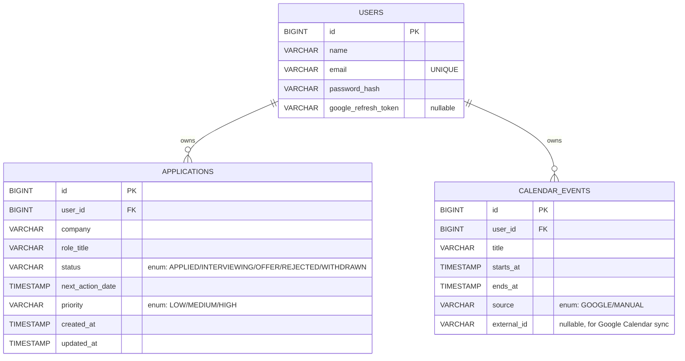

# Milestone 3 — Entity–Relationship Diagram

FocusFlow persists three entities in a file-based H2 database (`jdbc:h2:file:./data/propath`). Schema is derived from JPA annotations via Hibernate (`spring.jpa.hibernate.ddl-auto=update`).

## Relationships

- **User 1 — N JobApplication**: `@ManyToOne(fetch = LAZY, optional = false)` on [JobApplication.user](../../backend/src/main/java/com/blackcs/propath/model/JobApplication.java). Cascade: none (applications created/deleted independently via the service layer; ownership validated at the service level).
- **User 1 — N CalendarEvent**: same pattern on [CalendarEvent.user](../../backend/src/main/java/com/blackcs/propath/model/CalendarEvent.java).

## Validation

All write endpoints use Jakarta Bean Validation annotations on the request DTOs:
- [RegisterUserRequest](../../backend/src/main/java/com/blackcs/propath/dto/RegisterUserRequest.java): `@NotBlank`, `@Email`, `@Size(min=8)` on password.
- [CreateJobApplicationRequest](../../backend/src/main/java/com/blackcs/propath/dto/CreateJobApplicationRequest.java): all fields required; enum values enforced by Jackson.
- [LoginRequest](../../backend/src/main/java/com/blackcs/propath/dto/LoginRequest.java): `@NotBlank`, `@Email`.

Business rules enforced in services:
- `email` uniqueness (case-insensitive) on registration → 409 Conflict.
- `endsAt > startsAt` for calendar events.
- Ownership — every mutation and single-record GET on applications and calendar events verifies the record belongs to the authenticated user → 403 otherwise.
